# Action Catalog Visual Map

This document provides visual representations of the Action Catalog architecture.

---

## 📊 Action Distribution by Category

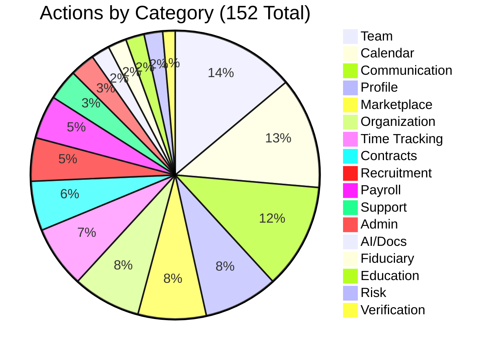

---

## 🏗️ Architecture Overview

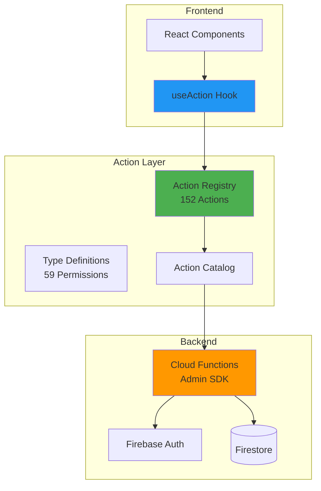

---

## 🔐 Permission Hierarchy

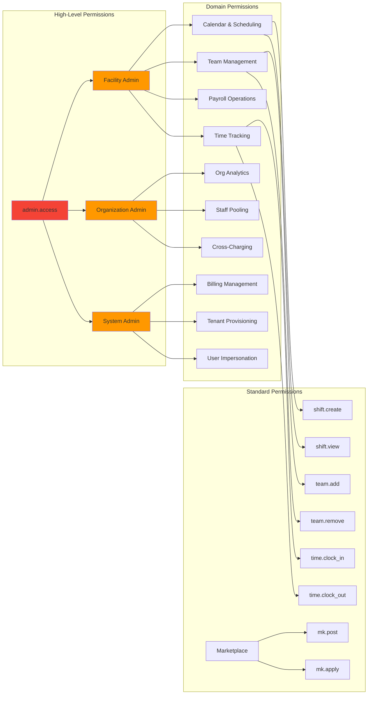

---

## 🔄 Action Execution Flow

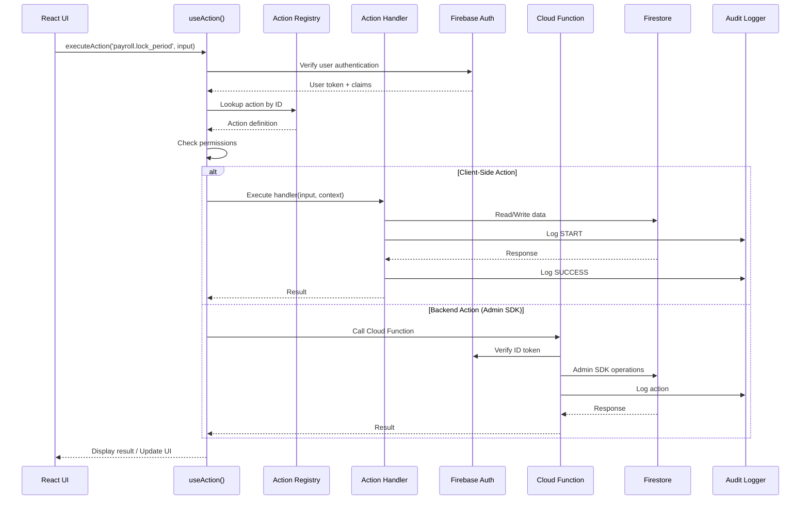

---

## 📂 Directory Structure

```mermaid
graph TD
    Root[src/services/actions/]
    
    Root --> Registry[registry.ts<br/>152 actions]
    Root --> Types[types.ts<br/>59 permissions]
    Root --> Catalog[catalog/]
    Root --> Middleware[middleware/]
    
    Catalog --> Admin[admin/ - 4]
    Catalog --> AI[ai/ - 3]
    Catalog --> Calendar[calendar/ - 18]
    Catalog --> Communication[communication/ - 17]
    Catalog --> Contracts[contracts/ - 8]
    Catalog --> Education[education/ - 3]
    Catalog --> Fiduciary[fiduciary/ - 3]
    Catalog --> Marketplace[marketplace/ - 11]
    Catalog --> Organization[organization/ - 11]
    Catalog --> Payroll[payroll/ - 7]
    Catalog --> Profile[profile/ - 12]
    Catalog --> Recruitment[recruitment/ - 7]
    Catalog --> Risk[risk/ - 3]
    Catalog --> Support[support/ - 5]
    Catalog --> Team[team/ - 20]
    Catalog --> Time[time/ - 10]
    Catalog --> Verification[verification/ - 2]
    
    style Registry fill:#4CAF50
    style Types fill:#4CAF50
    style Catalog fill:#2196F3
    style Middleware fill:#FF9800
```

---

## 🚦 Action Risk Levels

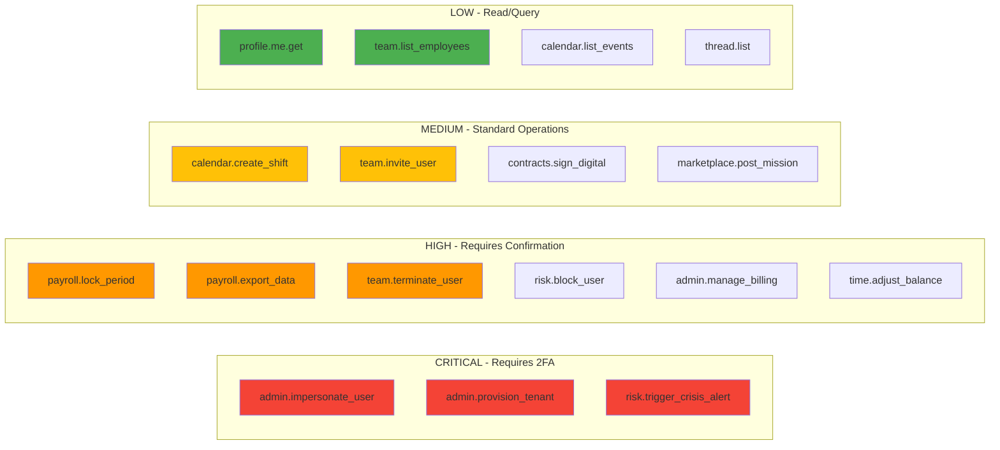

---

## 🔄 State Machine: Payroll Period Lifecycle

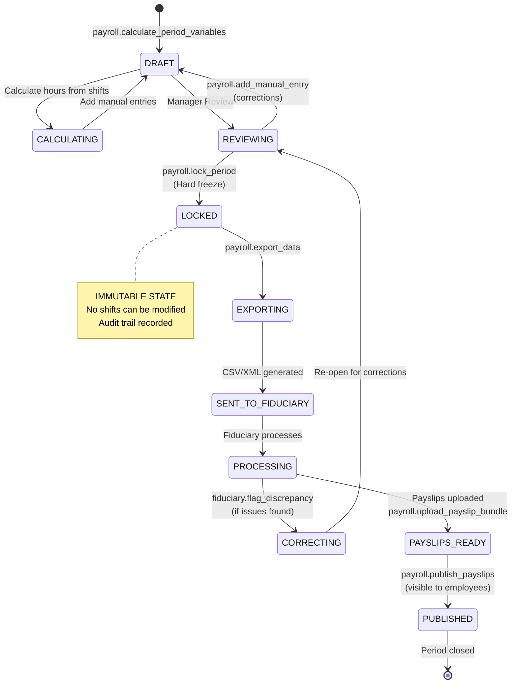

---

## 🌐 Multi-Tenant Architecture

```mermaid
graph TB
    User[User Account]
    
    subgraph "Workspace Selection"
        Personal[Personal Workspace<br/>workspace.switch]
        Facility[Facility Workspace<br/>workspace.switch]
        Organization[Org Workspace<br/>workspace.switch]
        AdminWS[Admin Workspace<br/>workspace.switch]
    end
    
    subgraph "Custom Claims in JWT"
        Claims[workspaceId<br/>workspaceType<br/>facilityId<br/>role<br/>permissions[]]
    end
    
    subgraph "Action Context"
        Context[userId<br/>facilityId<br/>userPermissions<br/>auditLogger]
    end
    
    subgraph "Data Access"
        DB1[(Facility 1<br/>Firestore)]
        DB2[(Facility 2<br/>Firestore)]
        DB3[(Org Data<br/>Firestore)]
    end
    
    User --> Personal
    User --> Facility
    User --> Organization
    User --> AdminWS
    
    Facility --> Claims
    Claims --> Context
    
    Context --> DB1
    Context --> DB2
    Context --> DB3
    
    note right of Claims
        "Passport" issued by backend
        Embedded in Firebase ID Token
        Verified on every request
    end note
    
    style Claims fill:#4CAF50
    style Context fill:#2196F3
```

---

## 📊 Implementation Progress Timeline

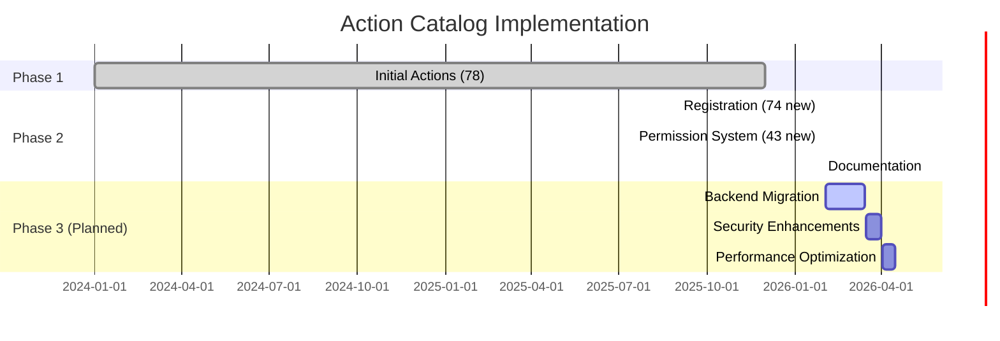

---

## 🔗 Action Dependencies

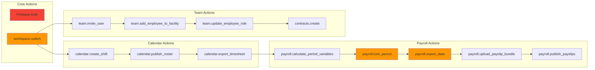

---

## 📈 Action Usage Patterns

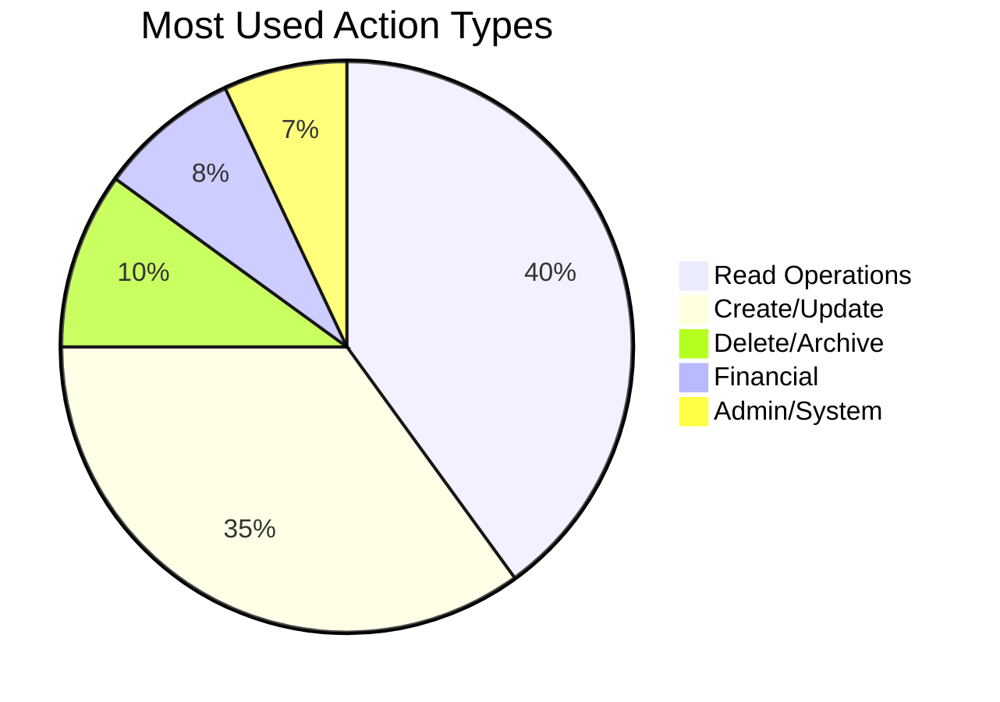

---

## 🎯 Future Enhancements

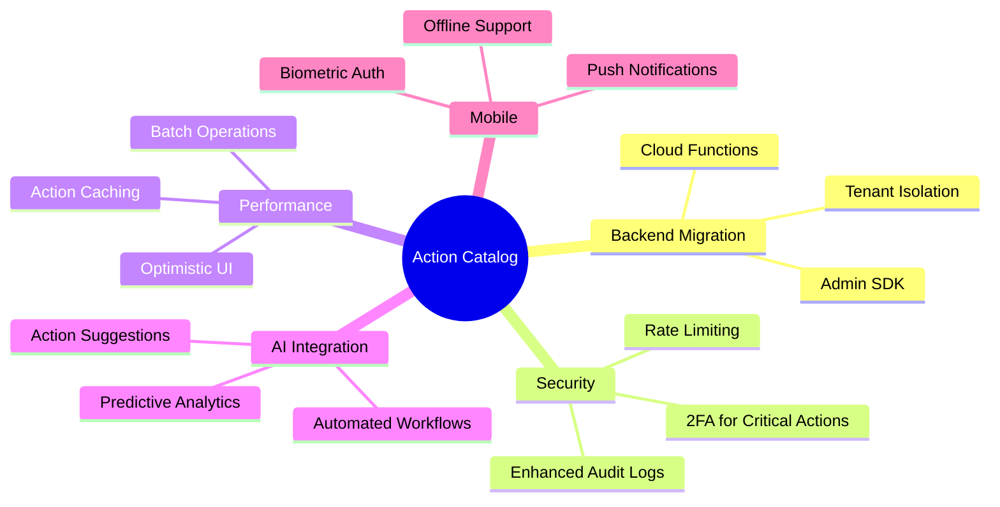

---

## 🔍 Action Search & Discovery

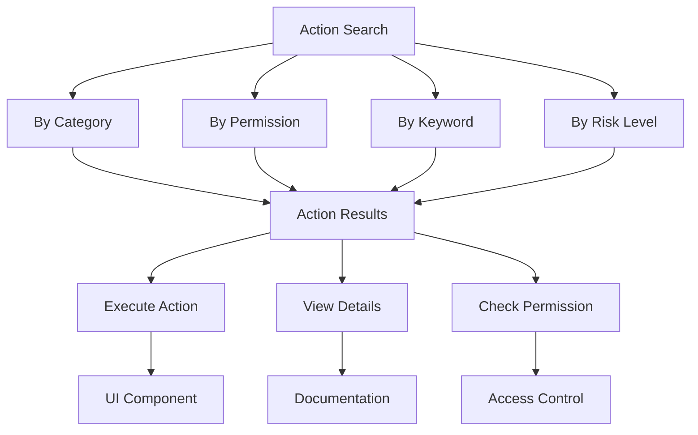

---

## 📝 Legend

| Symbol | Meaning |
|--------|---------|
| 🆕 | Newly registered action |
| ✅ | Complete and tested |
| 🔴 | High risk / Critical |
| 🟡 | Medium risk |
| 🟢 | Low risk / Safe |
| 🔒 | Requires special permission |
| 📊 | Returns data/analytics |
| 💾 | Modifies database |
| 🔄 | State transition |

---

**Generated**: 2026-01-28  
**Total Actions**: 152  
**Total Permissions**: 59  
**Status**: ✅ Complete

